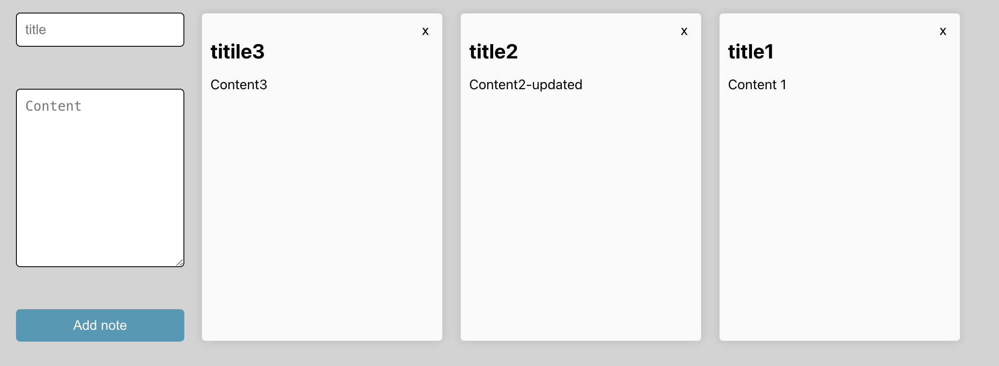

# Notes React + Node js
App to create, edit and delete the notes.

## Tech Stack:
- React
- CSS
- Prisma
- Supabase
- Typescript
- RWD

## How to run:
- `git clone git@github.com:karolina-rachuta/Notes_React_Node_Js.git`
- `npm install`
- `cd notes-app-server` -> `npm install`
- `npm start`
- `cd notes-app-server` -> `npm start`
- profit!

## Screenshots:

## Acknowledgment
Thanks to Chris Blakely